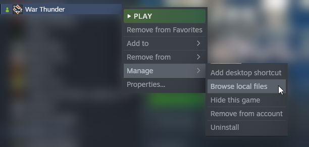

# For steam
Within steam, follow these prompts. 
 Manage > Browse local files">

# For standalone Windows default path
``C:\Program Files\War Thunder`` or ``C:\Program Files (x86)\War Thunder``

# For standalone Linux
You should know where you put it.