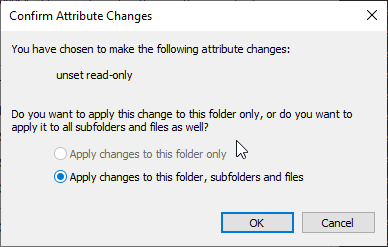

# How to permit changes to the lang folder on Windows

By default, the lang folder is inaccessible and configured to be read-only, these steps need to be taken for the automated application of new lang-entries.

Navigate to the location of the ```lang``` folder, and un-tick the ``Read-only (Only applies to files in folder)`` option and hit ``Apply``. <br>


When asked how to apply the actions choose ``Apply changes to this folder, subfolder and files`` <br>
y